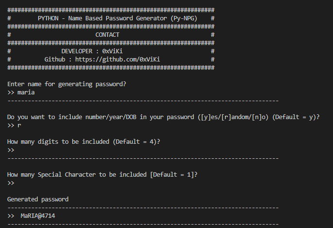
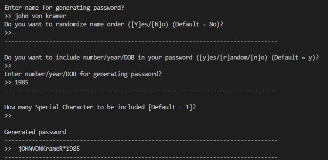
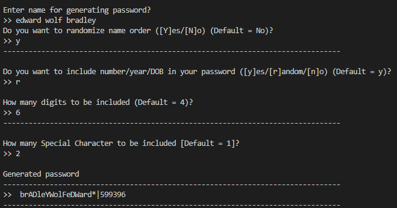

</img>
# py-NPG
Python Name-Based Password Generator</br></br>
Generates random upper-case & lower-case password based on user's name, number and special character.
</br></br></br></br>

#### Usage:
##### Windows
```
Download zip and extract & run.
python pynpg.py
```
##### Linux
```
git clone https://github.com/0xViKi/py-NPG
cd py-NPG 
python3 pynpg.py
```

#### Screenshots:
</img>
</img>
</img>


